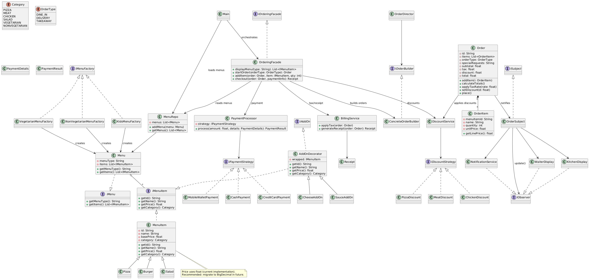

<p align="center">
  
</p>

# ┏━ Restaurant Ordering & Billing System ━━━━━━━━━━━━━━

A **modular, extensible CLI-based Restaurant Ordering & Billing System** implemented in **Java**.  
Demonstrates **SOLID principles** and common **OO design patterns** (Factory, Builder, Decorator, Strategy, Observer, Facade) with a working **ordering → payment → billing workflow**.

---

## ┏━ Features ━━━━━━━━━━━━━━━━━━━━━━━━━━━━━

- Multiple menu families: Vegetarian, Non‑Vegetarian, Kids *(Abstract Factory)*  
- Menu items with variants: Pizza, Burger, Salad  
- Customizable add-ons using Decorator (cheese, sauces)  
- Order creation using Builder pattern  
- Order notifications to kitchen/waiter via Observer  
- Payment processing with Strategy pattern (Cash, Credit Card, Mobile Wallet)  
- Automatic discount strategies applied  
- Billing service calculates taxes, applies discounts, and generates receipts  
- Facade pattern provides a unified ordering workflow  

---

## ┏━ Project Structure ━━━━━━━━━━━━━━━━━━━━━

<p align="center">
  
</p>

## ┏━ Design Patterns ━━━━━━━━━━━━━━━━━━━━━

| Pattern | Purpose |
|---------|---------|
| Abstract Factory / Factory | Menu family creation |
| Builder | Constructing Order objects |
| Decorator | Adding menu item add-ons |
| Strategy | Payment & discount algorithms |
| Observer | Order notifications (Kitchen / Waiter) |
| Facade | Simplified ordering API |

## ┏━ Build & Run ━━━━━━━━━━━━━━━━━━━━━━━

```powershell
# Create bin directory
mkdir -Force bin

# Compile all .java files
& javac -d bin @(Get-ChildItem -Recurse -Filter *.java | ForEach-Object { $_.FullName })

# Run the application
& java -cp bin Main
      


      
